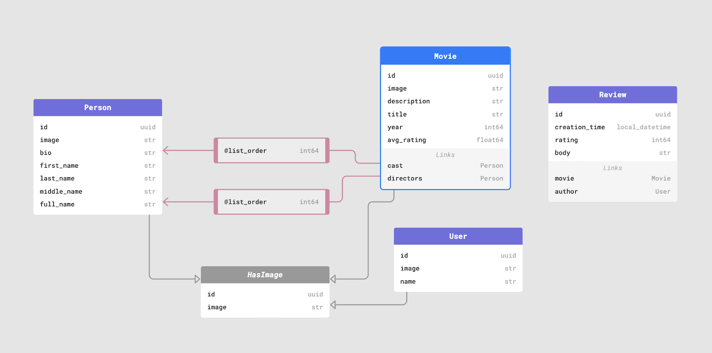

RealCruddyBench: Realistic benchmarks for ORMs
==============================================

``Rev. 1.0.0``

A benchmark intended to compare various Python and JavaScript 
ORMs against EdgeDB and other databases, using realistic queries. 

Why is this needed?
-------------------

The question of ORM performance is more complex than simply "they generate slow queries".

1. It's common for ORMs to perform non-trivial operations (deep fetching, 
   nested mutation, inline aggregation, etc) by opaquely executing several 
   queries under the hood. This may not be obvious to the end user. The 
   incurred latency is rarely reflected in more simplistic ORM benchmarks.

2. Less mature ORMs often don't support functionality like aggregations 
   (that is, counts/statistics/averages of different fields or objects). In these cases, users to use suboptimal or convoluted solutions.

   For instance, in some extreme cases, operations like "count the number of movies in the database" requires running a query for all movie records and manually counting the results client side. Even in advanced ORMs, nested aggregations are rarely possible, such as "find the movie with title X, return its title and the number of reviews about it". 
   
3. Since ORMs often force users to run several queries to obtain the full set 
   of data they need, transactions are required to ensure data consistency 
   among these serially-executed queries. This can rapidly place unacceptable limits on read capacity. However, while dispensing with transactions would simplify the implementation, it can result in hard-to-reproduce data integrity bugs.

Targets
-------

The benchmarks target the following set of ORMs and databases.

**Python ORMs**

- `Django ORM v3 <https://docs.djangoproject.com/en/4.0/topics/db/queries/>`_
- `SQLAlchemy 1.4 <https://www.sqlalchemy.org/>`_

**JavaScript ORMs**

- `Prisma v3 <https://www.prisma.io/>`_
- `TypeORM 0.2.41 <https://typeorm.io/#/>`_
- `Sequelize v6 <https://sequelize.org/>`_
- `EdgeDB query builder <https://www.edgedb.com/docs/clients/01_js/index>`_

**Databases/CMS**

- `Hasura v2 <https://hasura.io/>`_
- `Postgraphile 4.11 <https://www.graphile.org/postgraphile/>`_
- `MongoDB 5.0 + Python client <https://www.mongodb.com/>`_
- `Postgres 13 <https://www.postgresql.org/docs/13/index.html>`_
   - with ``asyncpg``
   - with ``psycopg2``
   - with ``pq``
   - with ``pgx``
   - with ``pg`` (Node.js)

- `EdgeDB 1.0 <https://edgedb.com>`_ 
   - `Node.js client <https://github.com/edgedb/edgedb-js>`_
   - `Python client <https://github.com/edgedb/edgedb-python>`_
   - `Go client <https://github.com/edgedb/edgedb-go>`_
   - `GraphQL endpoint <https://www.edgedb.com/docs/graphql/index>`_
   - `EdgeQL-over-HTTP <https://www.edgedb.com/docs/clients/90_edgeql/index>`_

Methodology
-----------

This benchmark is called RealCruddyBench, as it attempts to quantify performance of realistic queries that will be required be any non-trivial web application. In this case, we are simulating a `Letterboxd <https://letterboxd.com/>`_-style movie review website. 

Schema
^^^^^^

The schema consists of four main types.

- ``Person`` (used to represent the cast and crew) 
- ``Movie``
  - ``directors -> Person`` (to many)
  - ``cast -> Person`` (to many)
- ``User``
- ``Review``
  - ``author -> User`` (to one)
  - ``movie -> Movie`` (to one)

The schema contains some additional complexities that are often encountered in real applications.

- The ``Movie.cast`` and ``Movie.directors`` relations must be able to be stored and retrieved in a particular *order*. This ordering (called ``list_order``) represent the movie's `billing order <https://en.wikipedia.org/wiki/Billing_(performing_arts)>`_. 
- The ``Movie.cast`` relation should store the ``character_name``, either in the join table (in relational DBs) or as a link property (EdgeDB).

Queries
^^^^^^^

The following queries have been implemented for each target.

- ``insert_movie``: Insert a ``Movie``, setting its ``cast`` and ``directors`` 
  with pre-existing ``Person`` objects. Return the new ``Movie``, including 
  all its properties, its ``cast``, and its ``directors``. This query 
  evaluates *nested mutations* and *the ability to insert and query in a 
  single step*.

  .. raw:: html
    

      
View query

      <code>
        with 
        new_movie := (
          insert Movie {
            title := <str>$title,
            image := <str>$image,
            description := <str>$description,
            year := <int64>$year,
            directors := (
              insert Person {
                first_name := <str>$dfn,
                last_name := <str>$dln,
                image := <str>$dimg,
              }
            ),
            cast := {
              ( insert Person {
                  first_name := <str>$cfn0,
                  last_name := <str>$cln0,
                  image := <str>$cimg0,
              }),
              ( insert Person {
                  first_name := <str>$cfn1,
                  last_name := <str>$cln1,
                  image := <str>$cimg1,
              })
            }
          }
        )
        select new_movie {
          id,
          title,
          image,
          description,
          year,
          directors: { id, full_name, image } order by .last_name,
          cast: { id, full_name, image } order by .last_name,
        };
      </code>
    

.. collapse:: Get Movie

  Fetch a ``Movie`` by ID, including all its properties, its ``cast`` (in ``list_order``), its ``directors`` (in ``list_order``), and its associated ``Reviews`` (including basic information about the review ``author``). This query evaluates *deep (3-level) fetches* and *ordered relation fetching*.

  .. code-block::

    with m := Movie
    select m {
      id,
      image,
      title,
      year,
      description,
      avg_rating,
      directors: { 
        id, 
        full_name, 
        image 
      } order by @list_order empty last
        then m.directors.last_name,
      cast: {
        id,
        full_name,
        image,
      } order by @list_order empty last
        then m.cast.last_name,
      reviews := (
        select m.<movie[is Review] {
          id,
          body,
          rating,
          author: {
            id,
            name,
            image,
          }
        }  order by .creation_time desc
      )
    }
    filter .id = <uuid>$id;

.. collapse:: Get User

  Fetch a ``User`` by ID, including all its properties and 10 most recently written ``Reviews``. For each review, fetch all its properties, the properties of the ``Movie`` it is about, and the *average rating* of that movie (averaged across all reviews in the database). This query evaluates *reverse relation fetching* and *relation aggregation*.

  .. code-block::

    select User {
      id,
      name,
      image,
      latest_reviews := (
        select .<author[is Review] {
          id,
          body,
          rating,
          movie: {
            id,
            image,
            title,
            avg_rating := math::mean(.<movie[is Review].rating)
          }
        }
        order by .creation_time desc
        limit 10
      )
    }
    filter .id = <uuid>$id;
      

Why "Just use SQL" doesn't work
^^^^^^^^^^^^^^^^^^^^^^^^^^^^^^^

The goal of this benchmark is not to attack ORM libraries; they provide a solution to some of SQL's major usability issues. 

1. They can express deep or nested queries in a compact and intuitive way. 
   Queries return objects, instead of a flat list of rows that must be 
   manually denormalized.
2. They allow schema to be modeled a declarative, object-oriented way.
3. They provide idiomatic, code-first data fetching APIs for different 
   languages. This is particularly important as statically typed languages like Go and TypeScript gain popularity; the ability of ORMs to return strongly-typed query results in a DRY, non-reduntant way is increasingly desirable.

However, the limitations of ORMs can be crippling as application complexity and traffic scale. Our goal in designing EdgeDB is to provide a third option with the best of all worlds.

.. list-table::

  * - 
    - ORMs
    - SQL
    - EdgeDB
  * - Intuitive nested fetching
    - 🟢
    - 🔴
    - 🟢
  * - Declarative schema
    - 🟢
    - 🔴
    - 🟢
  * - Structured query results
    - 🟢
    - 🔴
    - 🟢
  * - Idiomatic APIs for different languages
    - 🟢
    - 🔴
    - 🟢
  * - Comprehensive standard library
    - 🔴
    - 🟢
    - 🟢
  * - Computed properties
    - 🔴
    - 🟢
    - 🟢
  * - Aggregates
    - 🟡
    - 🟢
    - 🟢
  * - Computed properties
    - 🔴
    - 🟢
    - 🟢
  * - Composable subquerying
    - 🔴
    - 🔴
    - 🟢

Running locally
---------------

.. collapse:: Local setup instructions

  #. Install Python 3.8+ and create a virtual environment.

    .. code-block::
    
        python -m venv my_venv
    
  #. Install dependencies from ``requirements.txt``

    .. code-block::
    
        pip install -r requirements.txt

  #. Install the following toolchains:

    - `EdgeDB <https://www.edgedb.com/install>`_
    - `PostgreSQL 13 <https://www.postgresql.org/docs/13/installation.html>`_
    - `Golang <https://go.dev/doc/install>`_
    - (Optional) `MongoDB <https://docs.mongodb.com/manual/installation/>`_

  #. Install `Node.js <https://nodejs.org/en/download/>`_ v14.16.0+.

  #. Install `Docker <https://docs.docker.com/get-docker/>`_ and `docker-compose <https://docs.docker.com/compose/install/>`_ (needed for Hasura).

  #. Install ``synth``. (https://www.getsynth.com)

  #. [Optional] A sample dataset consisting of 25k movies, 100k people, 100k 
    users, and 500k reviews already exists in the ``dataset/build`` 
    directory. If you wish, you can generate a fresh dataset like so: 
    
    .. code-block::

        $ make new-dataset

    You can also customize the number of inserted objects with the arguments ``people``, ``user``, and ``reviews``.

    .. code-block::

        $ make new-dataset people=5000 user=1000 reviews=100

  #. Load the data into the test databases via ``$ make load``. Alternatively, 
    you can run the loaders one at a time with the following commands:

    .. code-block::

        $ make load-edgedb 
        $ make load-postgres
        $ make load-mongodb 
        $ make load-django 
        $ make load-sqlalchemy  
        $ make load-typeorm 
        $ make load-sequelize 
        $ make load-prisma 
        $ make load-hasura 
        $ make load-postgraphile

  #. Compile Go files: ``$ make go``

  #. Compile TypeScript files: ``$ make ts``

  #. Run the benchmarks via ``bench.py``.

    To run all benchmarks:

    .. code-block::

        python bench.py --html out.html --concurrency 10 -D 10 all

    To run all JavaScript ORM benchmarks:

    .. code-block::

        python bench.py --html out.html --concurrency 10 --duration 10 typeorm,sequelize,postgres_prisma_js,edgedb_querybuilder

    To run all Python ORM benchmarks:

    .. code-block::

        python bench.py --html out.html --concurrency 10 --duration 10 django,sqlalchemy
    
    To customize the targets, just pass a comma-separated list of the following options.

    - ``edgedb_json_sync``
    - ``edgedb_json_async``
    - ``edgedb_repack_sync``
    - ``edgedb_graphql_go``
    - ``edgedb_http_go``
    - ``edgedb_json_go``
    - ``edgedb_repack_go``
    - ``django``
    - ``django_restfw``
    - ``mongodb``
    - ``sqlalchemy``
    - ``postgres_asyncpg``
    - ``postgres_psycopg``
    - ``postgres_pq``
    - ``postgres_pgx``
    - ``postgres_hasura_go``
    - ``postgres_postgraphile_go``
    - ``edgedb_json_js``
    - ``edgedb_repack_js``
    - ``edgedb_querybuilder_js``
    - ``edgedb_querybuilder_uncached_js``
    - ``typeorm``
    - ``sequelize``
    - ``postgres_js``
    - ``postgres_prisma_js``
    - ``postgres_prisma_tuned_js``

    You can see a full list of command options like so:

    .. code-block::

        python bench.py --help

License
-------

Apache 2.0.
