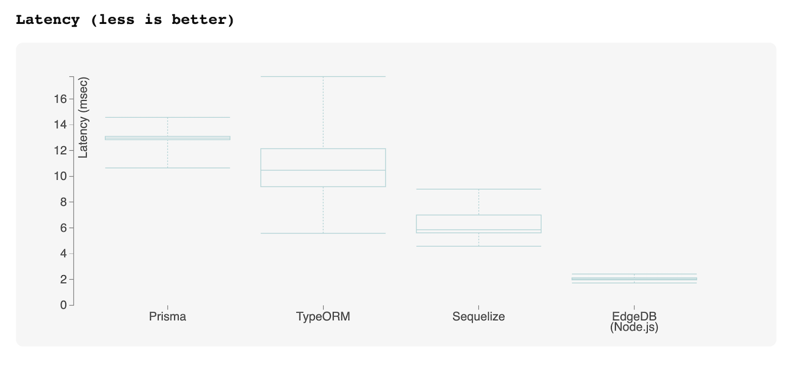
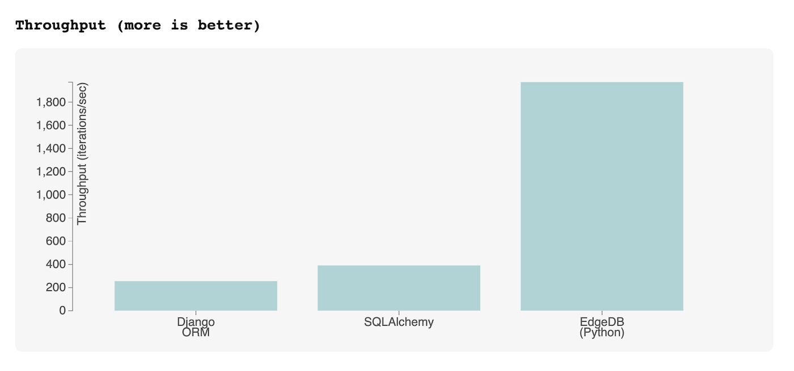
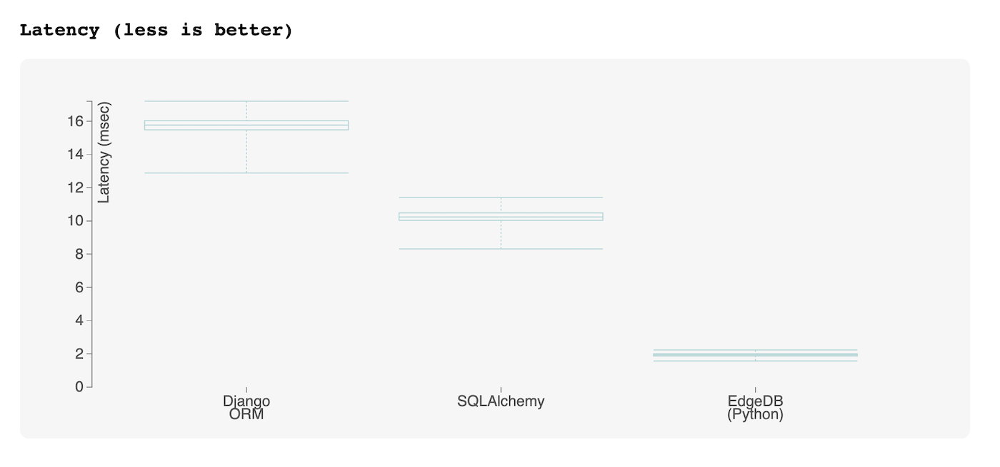
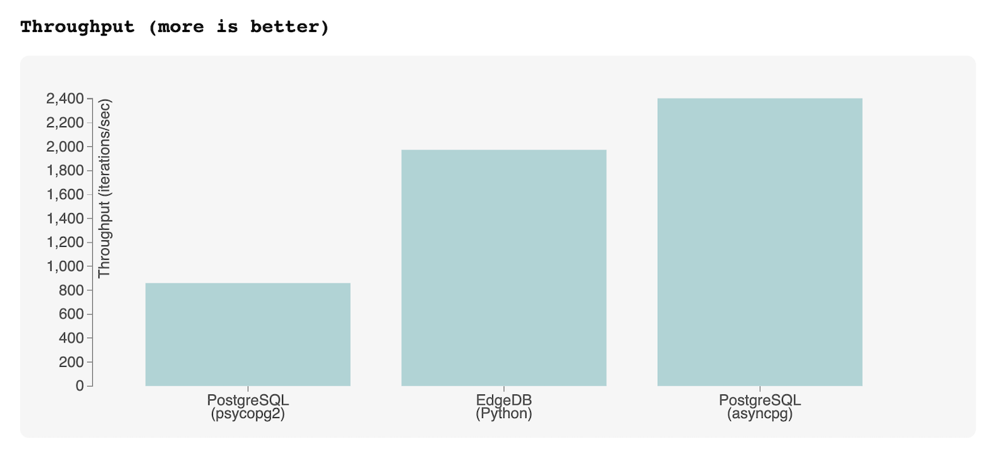
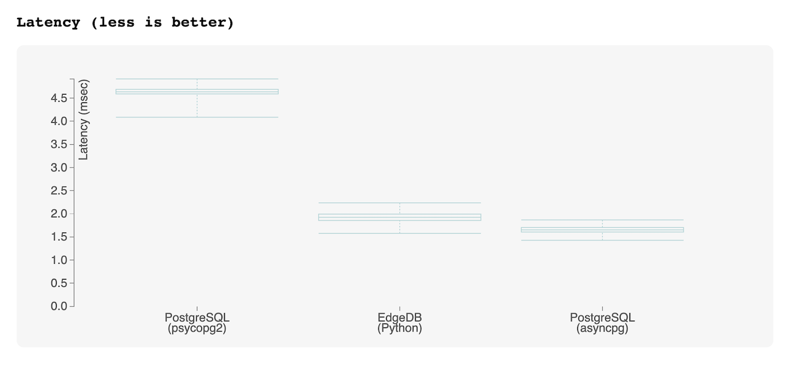

CruddyBench: Benchmarking ORMs with realistic queries
=====================================================

``Rev. 1.0.0``

A benchmark intended to compare various Python and JavaScript 
ORMs against EdgeDB and other databases, using realistic queries. 

Why is this needed? 🧐
---------------------

The question of ORM performance is more complex than simply "they generate 
slow queries".

- **Query splitting ⛓**

   It's common for ORMs to perform non-trivial operations (deep fetching, 
   nested mutation, inline aggregation, etc) by opaquely executing several 
   queries under the hood. This may not be obvious to the end user. The 
   incurred latency is rarely reflected in 
   `more <https://github.com/tortoise/orm-benchmarks>`_ 
   `simplistic <https://github.com/emanuelcasco/typescript-orm-benchmark>`_ 
   ORM benchmarks.

- **Aggregation (or lack thereof) 🪣**

   Less mature ORMs often don't support functionality like aggregations 
   (counts, statistics, averages, etc), forcing users to overfetch and perform 
   these calculations server-side. Some ORMs provide no aggregation 
   functionality at all; even advanced ORMs rarely support relational 
   aggregations, such as ``Find the movie where id=X, returning its title and 
   the number of reviews about it.``
   
- **Transactional queries 🏦**

   Since ORM users must often run several correlated queries in series to 
   obtain the full set of data they need, the possibility for 
   hard-to-reproduce data integrity bugs is introduced. Transactions can 
   alleviate these bugs but can rapidly place unacceptable limits on read 
   capacity. 

Methodology 👷
-------------

This benchmark attempts to quantify the **throughput** (iterations/second) and 
**latency** (milliseconds) of a set of **realistic** CRUD queries. These 
queries are not arcane or complex, nor are they unreasonably simplistic (as 
benchmarking queries tend to be). Queries of comparable complexity will be 
necessary in any non-trivial web application. 

Simulated server-database latency 🐇
^^^^^^^^^^^^^^^^^^^^^^^^^^^^^^^^^^^

The execution environment simulates a *1 millisecond* latency between the 
server and database. This is the 
`typical latency <https://aws.amazon.com/blogs/architecture/improving-performance-and-reducing-cost-using-availability-zone-affinity/>`_ 
between zones in a single AWS region. The vast majority of applications do not 
have the resources to support per-availability-zone replication, so this 
assumption is reasonable.

With serverless architectures, it's common for server code to run inside 
Lambda-style functions in a different availability zone from the underlying 
database, which would incur latencies far greater than 1ms.

On Linux, this latency can be simulated with ``tc`` like so:

.. code-block::

  sudo tc qdisc add dev br-webapp-bench root netem delay 1ms

Dataset 🍿
^^^^^^^^^

We are simulating an `IMDB <https://imdb.com>`_-style movie database
website. The sample dataset consists of 25k movies, 100k people, 100k users, and 500k reviews.

.. image:: results/schema.png

The schema consists of four tables/models/types:

- ``Person`` (used to represent the cast and crew) 
- ``Movie``
  
  - ``directors -> Person`` (to many, orderable with ``list_order``)
  - ``cast -> Person`` (to many, orderable with ``list_order``)
- ``User``
- ``Review``
  
  - ``author -> User`` (to one)
  - ``movie -> Movie`` (to one)

Queries 
^^^^^^^

The following queries have been implemented for each target.

- ``insert_movie`` Evaluates *nested mutations* and *the ability to insert and 
  select in a single step*.

  Insert a ``Movie``, setting its ``cast`` and ``directors`` 
  with pre-existing ``Person`` objects. Return the new ``Movie``, including 
  all its properties, its ``cast``, and its ``directors``. 

  .. raw:: html

    

      
View query

      <pre>
    with 
      new_movie := (
        insert Movie {
          title := &lt;str&gt;$title,
          image := &lt;str&gt;$image,
          description := &lt;str&gt;$description,
          year := &lt;int64&gt;$year,
          directors := (
            select Person
            filter .id = (&lt;uuid&gt;$d_id)
          ),
          cast := (
            select Person
            filter .id in array_unpack(&lt;array&lt;uuid&gt;&gt;$cast)
          ),
        }
      )
    select new_movie {
      id,
      title,
      image,
      description,
      year,
      directors: { id, full_name, image } order by .last_name,
      cast: { id, full_name, image } order by .last_name,
    };
      </pre>
    

- ``get_movie`` Evaluates *deep (3-level) fetches* and *ordered 
  relation fetching*.

  Fetch a ``Movie`` by ID, including all its properties, its 
  ``cast`` (in ``list_order``), its ``directors`` (in ``list_order``), and its 
  associated ``Reviews`` (including basic information about the review 
  ``author``).

  .. raw:: html

    

      
View query

      <pre>
    with m := Movie
    select m {
      id,
      image,
      title,
      year,
      description,
      avg_rating,
      directors: { 
        id, 
        full_name, 
        image 
      } order by @list_order empty last
        then m.directors.last_name,
      cast: {
        id,
        full_name,
        image,
      } order by @list_order empty last
        then m.cast.last_name,
      reviews := (
        select m.&lt;movie[is Review] {
          id,
          body,
          rating,
          author: {
            id,
            name,
            image,
          }
        } order by .creation_time desc
      )
    }
    filter .id = &lt;uuid&gt;$id;
    </pre>
    

  
- ``get_user`` Evaluates *reverse relation fetching* and *relation 
  aggregation*.

  Fetch a ``User`` by ID, including all its properties and 10 most recently 
  written ``Reviews``. For each review, fetch all its properties, the 
  properties of the ``Movie`` it is about, and the *average rating* of that 
  movie (averaged across all reviews in the database). 

  .. raw:: html

    

View query
<pre>
    select User {
      id,
      name,
      image,
      latest_reviews := (
        select .&lt;author[is Review] {
          id,
          body,
          rating,
          movie: {
            id,
            image,
            title,
            avg_rating := math::mean(.&lt;movie[is Review].rating)
          }
        }
        order by .creation_time desc
        limit 10
      )
    }
    filter .id = &lt;uuid&gt;$id;
    </pre>

      

Results 📊
---------

The graphs below present the throughput/latency results for each target as a 
geometric mean of the three queries. As such, it should be interpreted as a 
holistic benchmark that represents the target library's collective performance 
across a range of query functionality.
  
👀 For per-query results, interactive charts, and latency jitter statistics, 
view the full report!

JavaScript ORMs
^^^^^^^^^^^^^^^

`View Full Report <https://htmlpreview.github.io/?https://github.com/edgedb/webapp-bench/blob/master/results/js.html>`_

Python ORMs
^^^^^^^^^^^

`View Full Report <https://htmlpreview.github.io/?https://github.com/edgedb/webapp-bench/blob/master/results/py.html>`_

Raw SQL
^^^^^^^

For comparison, below are the benchmark results for a tuned 
PostgreSQL implementation of the benchmark queries, executed using two popular 
Postgres Python drivers (`asyncpg <https://github.com/MagicStack/asyncpg>`_ 
and `psycopg2 <https://pypi.org/project/psycopg2/>`_). For reference the 
EdgeDB results (using the `Python client 
<https://github.com/edgedb/edgedb-python>`_) are also included.

`View Full Report <https://htmlpreview.github.io/?https://github.com/edgedb/webapp-bench/blob/master/results/pysql.html>`_

Analysis
--------

Predictably, ORMs perform poorly on this benchmark relative to EdgeDB or raw 
SQL, both of which can express more complex operations in a single query. 

However, *the goal of this benchmark is not to pick on ORM libraries*. ORMs 
provide a solution (albeit a limited one) to some of very real usability 
issues with relational databases.

1. They can express deep or nested queries in a compact and intuitive way. 
   Queries return objects, instead of a flat list of rows that must be 
   manually denormalized.
2. They allow schema to be modeled in a declarative, object-oriented way.
3. They provide idiomatic, code-first data fetching APIs for different 
   languages. This is particularly important as statically typed languages 
   like Go and TypeScript gain popularity; the ability of ORMs to return 
   strongly-typed query results in a DRY, non-reduntant way is increasingly 
   desirable.

It is a valid decision to prioritize developer experience over performance, 
especially when your expected traffic is low. However, the limitations of ORMs 
can be crippling as an application scales in complexity and traffic. 

The third way
^^^^^^^^^^^^^

Our goal in designing EdgeDB is to provide a third option that combines the 
best of all worlds. Using EdgeDB feels like using an ORM: your schema is 
declarative, your queries return structured objects, and you don't need to 
deal with the hairiness of SQL. (If you're using our `TypeScript query builder 
<https://www.edgedb.com/docs/clients/01_js/index#the-query-builder>`_, you 
even get full static typing.) But, vitally, you can reap these benefits 
without the sacrificing performance or the power of a full-fledged query 
language. 

.. list-table::

  * - 
    - ORMs
    - SQL
    - EdgeDB
  * - Intuitive nested fetching
    - 🟢
    - 🔴
    - 🟢
  * - Declarative schema
    - 🟢
    - 🔴
    - 🟢
  * - Structured query results
    - 🟢
    - 🔴
    - 🟢
  * - Idiomatic APIs for different languages
    - 🟢
    - 🔴
    - 🟢
  * - Comprehensive standard library
    - 🔴
    - 🟢
    - 🟢
  * - Computed properties
    - 🔴
    - 🟢
    - 🟢
  * - Aggregates
    - 🟡
    - 🟢
    - 🟢
  * - Composable subquerying
    - 🔴
    - 🔴
    - 🟢

Visit `edgedb.com <https://www.edgedb.com>`_ to learn more.

Running locally
---------------

Follow the instructions in the `Run Locally <DEVELOP.rst>`_ guide to execute 
these benchmarks on your local machine.

License
-------

Apache 2.0
